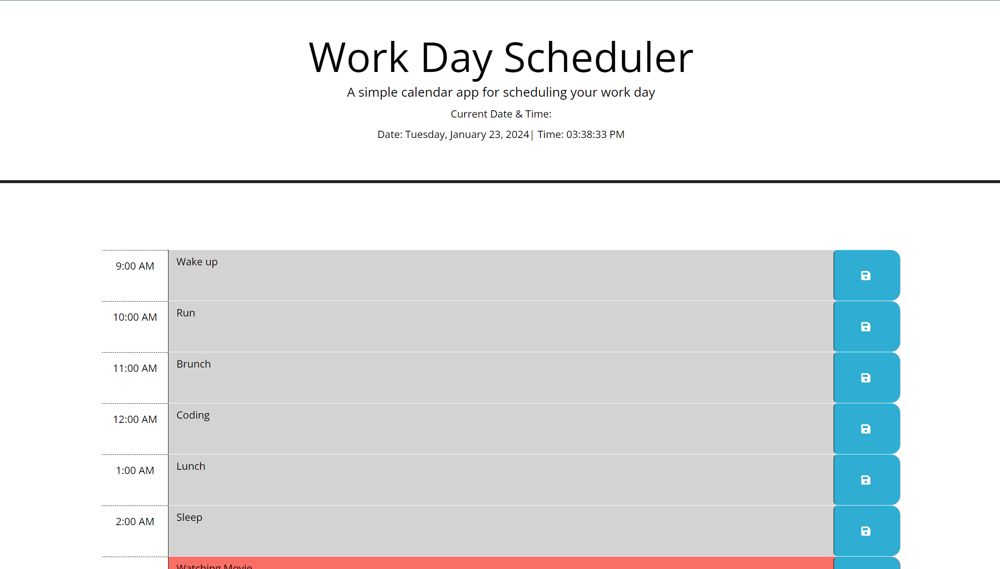

# Calendar-events-applications

## Description 
I designed a calendar events scheduler for the hours spanning from 9AM to 5PM. The application allows users to enter their task for the day in a given time slot. 
The web application uses Day.js to handle dates and time. The good news is that if a time slot is in the past, it is colour-coded gray. A current time slot is shaded in a red background and any future time slots appear in a green background colour.

The user can write tasks in future time slots and the data is saved to a local storage.

When the page is refreshed, the saved events persist
 The application has a visual appeal and guides them to give first priority to the current and future time slot tasks. 

The web application has been designed using HTML, CSS, JavaScript, Bootstrap, JQuery and Google Fonts. 

T

## Table of Contents (Optional)
N/A

## Installation

The web portfolio does not require any installation and will run on most internet browsers. The web application is deployed at this link here and feel free to click and experience its magical works: https://mikemupararano.github.io/Bootstrap-Portfolio/.

## Usage 
To have an idea of what is in this web application, please click on this link: https://github.com/Mikemupararano/calendar-events-application/settings/pages
 https://mikemupararano.github.io/calendar-events-application/

## Credits
I used the following web-links for research and support:
(a) video on a similar task: https://www.google.com/search?q=work+scheduler+(javascript%2C+day.js)&rlz=1C1CHBF_enGB1042GB1042&oq=work+s&gs_lcrp=EgZjaHJvbWUqCAgAEEUYJxg7MggIABBFGCcYOzIGCAEQRRg5MgwIAhAAGEMYgAQYigUyDAgDEAAYQxiABBiKBTIKCAQQABixAxiABDIKCAUQABixAxiABDIHCAYQLhiABDIKCAcQLhixAxiABDIHCAgQABiABDIHCAkQABiABKgCALACAA&sourceid=chrome&ie=UTF-8#fpstate=ive&vld=cid:3ae864d9,vid:sm6py49QNto,st:0
(b) https://github.com/ThomasCalle/Online-Workday-Planner/blob/main/assets/script.js
(c) https://www.youtube.com/watch?v=sm6py49QNto
(d) https://github.com/EdenKhaos/05-work-day-scheduler
(e) https://github.com/EdenKhaos/05-work-day-scheduler/blob/master/assets/screenshot_scheduler.JPG
(f) https://www.youtube.com/watch?v=6EVgmpm4z5U
(g) https://mirzaleka.medium.com/the-complete-guide-to-day-js-fb835a5d945a

## License

See the repository for any information on the MIT license.
🏆 

## Badges
N/A
## Features

N/A
## Contributing

Any other contributors are welcome to contact me and add to my code or suggest improvements. Click on this link to contribute on improvements: https://github.com/Mikemupararano/calendar-events-application/settings/pages.

## Tests
N/A
© 2023 edX Boot Camps LLC. Confidential and Proprietary. All Rights Reserved.

